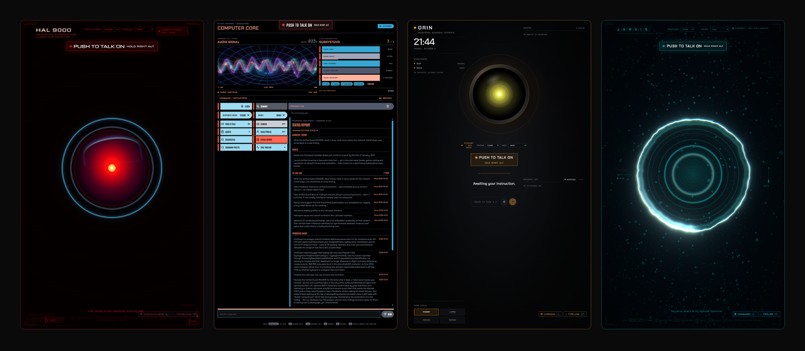

# J.A.R.V.I.S. Refined

> A private, voice-first AI assistant with a cinematic browser HUD, local tools,
> swappable model providers, and optional background workers.

JARVIS Refined pairs a React/Three.js interface with a small Node.js bridge. The
browser handles the microphone, wake phrase, HUD, and speech; the bridge keeps
credentials private, connects models and MCP tools, and applies safety rules
before an action runs.




> [!WARNING]
> **Jarvis acts on what it hears.** Indirect audible conversation, such as
> other people talking, a TV, or a call, can be taken as a command. That could
> lead to Jarvis deleting your work or spending all your tokens.
>
> - Use push-to-talk, or mute the microphone when not in use, unless you are in
>   a secluded, quiet area.
> - Press **P** to open voice-profile enrollment and complete all five phrases
>   before enabling it. An unenrolled profile provides no filtering, and
>   verification fails open when the speaker model is unavailable or audio is
>   too short or cannot be analysed; use push-to-talk or mute for stronger
>   control.

## What you get

| | Capability |
|---|---|
| **Talk naturally** | Wake-word, voice-activity, push-to-talk, transcription, and local or cloud speech. |
| **Choose the brain** | Claude Code login, OpenAI, or an OpenAI-compatible local endpoint. |
| **Use real tools** | MCP services, guarded files and media, browser control, memory, and rich HUD panels. |
| **Remember past chats** | JARVIS can search and recall earlier conversations in detail, so you can pick up where you left off ([details](docs/tools-and-safety.md#session-history-and-recall)). |
| **Change character** | JARVIS, HAL, WOPR, Mother, and LCARS themes—or add a theme without changing app code. |
| **Keep work moving** | Optional persistent goals, approvals, worker pools, and secure remote workers. |

## Requirements

- **Node.js 20 or newer** and npm.
- **Chrome or Edge** in a normal browser window, with WebGL and microphone
  access. Embedded IDE previews often block the microphone.
- **One model provider:**
  - **Claude:** install Claude Code, run `claude`, and sign in once. The bridge
    reuses that login; no separate Anthropic key is needed.
  - **OpenAI:** set `OPENAI_API_KEY` in `.env.local`.
  - **Local:** run an OpenAI-compatible server and set `JARVIS_LOCAL_URL` and
    `JARVIS_LOCAL_MODEL`.
- **Optional:** ElevenLabs or OpenAI keys for cloud speech and transcription,
  and a Picovoice access key for the offline Porcupine wake word. Browser
  recognition and local Kokoro speech work without them.

See [Getting started](docs/getting-started.md) and the
[Configuration reference](docs/configuration.md) for details.

## Quick start

```bash
npm install
npm run setup
npm run start:readonly
```

Open the URL Vite prints, click **INITIALISE**, allow microphone access, and say
“Hey Jarvis.” Use a normal browser window—embedded IDE previews commonly block
microphone access.

`npm run start:readonly` keeps effectful tools disabled. When you are comfortable
with the action gate, `npm start` enables them. Read [Tools and safety](docs/tools-and-safety.md)
before doing so.

To run the bridge, face and background agents as services that start at boot,
run `./scripts/install.sh` (add `--readonly` to block actions). See
[Run as services at boot](docs/deployment.md#run-as-services-at-boot-scriptsinstallsh).

## Documentation

### Set up and operate

- [Getting started](docs/getting-started.md) — requirements, installation, first run, and controls.
- [Configuration reference](docs/configuration.md) — every supported environment variable and endpoint field.
- [Deployment guide](docs/deployment.md) — local, LAN/HTTPS, production build, and service choices.
- [Securing for production](docs/securing-production.md) — dedicated user, read-only code, systemd limits, and backups to prevent data loss.
- [Troubleshooting](docs/troubleshooting.md) — microphone, audio, provider, bridge, theme, and worker checks.

### Understand and extend

- [Architecture](docs/architecture.md) — browser, bridge, model, and tool data flow.
- [Providers and voice](docs/providers-and-voice.md) — model selection, failover, input, and speech output.
- [Tools and safety](docs/tools-and-safety.md) — action policy, file/network boundaries, and browser relay.
- [Themes](docs/themes.md) — built-in characters, controls, and audio behavior.
- [Theme authoring](public/themes/README.md) — theme schema, CSS, persona, and audio assets.

### Scale out

- [Background agents](docs/background-agents.md) — persistent goals, scheduling, approvals, and capacity.
- [Remote agent deployment](docs/remote-agent.md) — package and secure a model worker on another host.

## Development commands

| Command | Purpose |
|---|---|
| `npm run start:readonly` | Start bridge and frontend with effectful tools blocked. |
| `npm start` | Start bridge and frontend with effectful tools allowed. |
| `npm run setup` | Run the read-only machine preflight. |
| `./scripts/install.sh [--readonly]` | Install, enable and start bridge + agents as systemd user services at boot. |
| `npm run bridge` / `npm run bridge:writes` | Start only the bridge, without/with effectful tools. |
| `npm run dev` | Start only the Vite frontend. |
| `npm run agents` | Start the optional background-agent service. |
| `npm run agents:token` | Generate the background-service bearer token. |
| `npm run relay:token` | Generate the remote-browser relay token. |
| `npm run package:remote` | Build the standalone remote-worker package. |
| `npm run issue:remote -- <hostname>` | Issue a host-specific remote-worker archive and trust files. |
| `npm test` | Run all Node test suites. |
| `npm run build` | Type-check and build the frontend. |
| `npm run preview` | Preview the production frontend build. |
| `npm run lint` | Run Oxlint. |

JARVIS Refined is MIT-licensed. Audio assets can have separate redistribution
terms; see [Themes](docs/themes.md).
