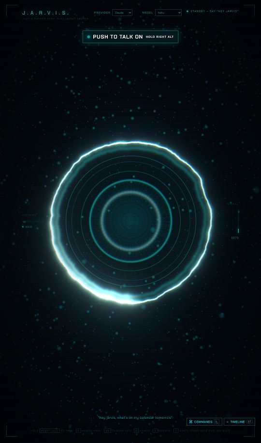
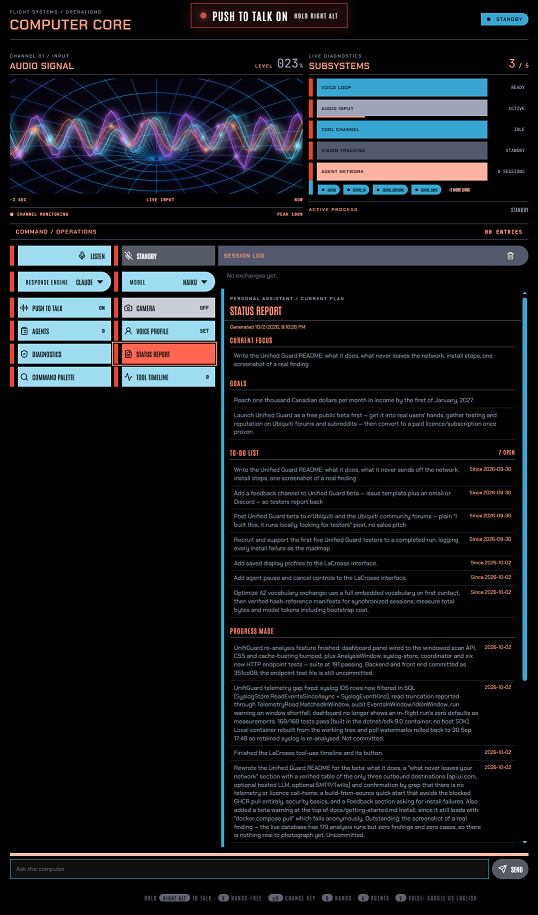
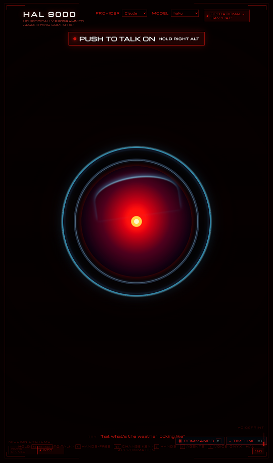
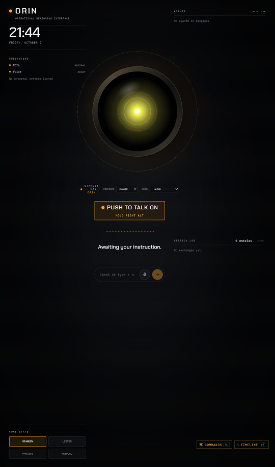

# Themes

Themes are a work in progress. Some work better than others. Each has a
different persona and can be temperamental. LCARS and Stark (JARVIS) are the
most reliable.

Themes change the assistant's character and the entire browser presentation:
palette, typography, wake phrase, persona, voice profile, audio, boot sequence,
and live animation. Built-in themes are stored in `public/themes/`:

| ID | Character | Wake phrase |
|---|---|---|
| `stark` | Cyan holographic JARVIS HUD | “Hey Jarvis” |
| `hal` | Red optical-computer console | “Hal” |
| `wopr` | Amber military CRT command grid | “Joshua” |
| `mother` | Green industrial mainframe terminal | “Mother” |
| `lcars` | LCARS-style computer display | “Computer” |
| `orin` | Amber operational reasoning console | “ORIN” |

## Add a Theme

Themes are drop-in folders under `public/themes/`. Create
`public/themes/my-theme/theme.json` with at least a name:

```json
{ "name": "My Theme" }
```

The app supplies defaults for anything you leave out. Add optional `theme.css`,
`persona.md`, audio files, or a `theme.tsx` module for custom components. The
folder name (`my-theme`) is the theme ID; no app-code registry or index file
needs updating. In development, reload the page after adding the folder. Try it
at `http://localhost:5173/?theme=my-theme`; that choice is remembered by the
browser. Production deployments need a new build to include the theme.

## Screenshots

### Stark


### LCARS


### HAL


### ORIN

Set `VITE_THEME` in `.env.local` and restart the dev server to change the
default. To preview another theme for the current browser, use a URL such as
`http://localhost:5173/?theme=hal`. The browser remembers the URL selection.

## Controls

| Input | Action |
|---|---|
| Theme wake phrase | Wake JARVIS. |
| **Space** | Speak without the wake phrase. |
| **K** | Toggle push-to-talk mode. |
| Hold **Right Alt** | Talk while held when push-to-talk is enabled. |
| **Shift+K** | Bind push-to-talk to another key or mouse button. |
| Speak while JARVIS is talking | Interrupt speech (barge-in). |
| **V** | Cycle the browser voice. |
| **Escape** | Stand down. |
| **D** | Open live diagnostics. |
| **T** | Run the audio self-test. |
| **G** | Toggle optional hand tracking and camera access. |
| **P** | Open voice-profile enrollment, re-recording, or removal. |
| **Shift+Space** | Open the command palette; the **Commands** launcher button also opens it. |
| **Shift+T** | Open the tool timeline; the **Timeline** launcher button also opens it. |
| **Shift+H** | Open session history; the **History** launcher button also opens it. |

The command palette searches available interface actions. The tool timeline
shows tool activity and elapsed time for the current session. Session history
lists past conversations and transcripts; it is stored in this browser's local
storage on this device, not synced to an account. It keeps session text,
timestamps, tool names and attachment names/metadata, not attached file bytes.

### Voice profile

Pressing **P** opens the profile workflow; it does not enroll a voice by itself.
Choose **Begin** and read all five prompted phrases to create a profile. The
profile is stored locally in this browser. It can reduce responses to other
speakers, but is not authentication or a security boundary: when no profile is
enrolled, the speaker model is unavailable, or a segment is too short or cannot
be analysed, verification allows the segment through. Use push-to-talk or mute
the microphone when stronger control is needed.

### Chat attachments

The LCARS and ORIN typed-chat composers accept files through the attachment
button, paste, or drag-and-drop. Up to 10 files and 25 MB total are accepted:
PNG, JPEG, GIF, or WebP images (5 MB each), PDFs (20 MB each), and UTF-8 text
files (512 KB each). Audio, video, and other binary formats are not accepted.
Attachment bytes are sent with that chat request; session history stores only
their names and metadata.

## Audio

Interface cues use local Web Audio synthesis unless a theme supplies a
recording. Theme recordings fall back to shared assets in `public/audio/`; music
uses the same theme-then-shared lookup. Task cues require the background-agent
connection. Use only audio you have rights to redistribute; franchise recordings
may be copyrighted even when they are easy to download.

For the theme folder layout, `theme.json` fields, scoped CSS, persona files, cue
names, and asset fallback rules, see the dedicated
[theme package authoring reference](../public/themes/README.md).
