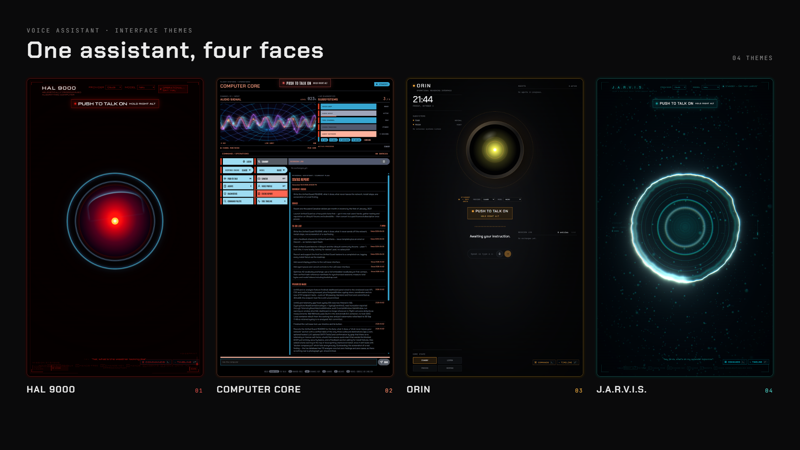

# Themes

A theme is a folder in this directory. Add one and reload the dev page; no
registry, shared component, or build configuration needs editing. Production
deployments need a new build to include newly added theme modules and the index.

```text
public/themes/my-theme/
  theme.json     required — everything the character is, as data
  theme.tsx      optional — local components and synthesised sound exports
  theme.css      optional — scoped under [data-theme='my-theme']
  persona.md     optional — the system prompt, as prose
  audio/         optional — cue and music recordings
  Boot.tsx       optional — intro component imported by theme.tsx
  Reactor.tsx    optional — live reactor imported by theme.tsx
```

Select it with `VITE_THEME=my-theme` in `.env.local`, or try it without editing
anything by loading `http://localhost:5173/?theme=my-theme`. The choice sticks
in that browser until another one is given.

The folder name is the id. Lowercase letters, digits, `-` and `_` only.

## theme.json

Every field is optional; what you leave out comes from the built-in defaults, so
a working theme.json can be two lines. Copy `stark/theme.json` and edit it —
that one sets everything, which makes it the best reference.

| Field | What it does |
|---|---|
| `name` | Human label for the theme. |
| `copy` | Every string the HUD shows: title, brand, per-phase status, rail titles, ignition button, the spoken audio-test line. |
| `backgroundColor` | Browser chrome colour (`meta[name=theme-color]`). |
| `phaseColors` | The accent for each phase: `offline`, `boot`, `dormant`, `waking`, `listening`, `thinking`, `tooling`, `speaking`. |
| `sceneTint` | Resting colours of the 3D reactor: `core`, `hot`, `particles`. |
| `wake.pattern` | JavaScript regex source matching the wake word **and its likely mishearings** — a speech recogniser will not spell your character's name the way you do. |
| `wake.phrases` | Spoken forms given to browsers that support phrase biasing. |
| `wake.language` | BCP-47 tag for speech recognition, e.g. `en-GB`. |
| `voice.engine` | `kokoro` or `system` to override the global speech engine for this theme. Omit or set `null` to inherit the environment settings. Engine failures still use the application's speech fallback. |
| `voice.kokoro` | Local neural voice id. See `VOICES` in `src/lib/kokoro.ts`. |
| `voice.character` | `british-male` or `computer` — which installed system voice to prefer when Kokoro is off. |
| `voice.profile` | Post-processing that gives the voice its box: speed, playback rate, filter band, presence lift, compression. |
| `sound.music` | Whether the theme has a score — the boot swell and the loop under a running tool. Off (the default) leaves the synthesised room tone as the only bed. |
| `sound.ambient` | The room tone: two oscillator frequencies, noise, lowpass cutoff and level. |
| `bootDurationMs` | Intro duration in milliseconds, default `9200`. Non-negative; `0` skips the timed wait. |
| `register` | `butler` or `machine` — which phrasebook the canned filler lines and agent announcements come from. |
| `suggestion` | One example command in the character's own idiom, for the idle hint. |
| `persona` | System prompt. `persona.md` wins if present. |
| `css` | Stylesheet filename, or `null` / `""` for none. Defaults to `theme.css`. |

## theme.tsx

This optional entry point is discovered automatically. It is compiled by Vite
in development and production, and checked by TypeScript. Only the selected
theme module is loaded. Keep its components, shaders, helper files, and assets
inside the same folder; shared application APIs can be imported from `src/`.

```tsx
import type { ThemePackage } from '../../../src/lib/theme-package'
import { Boot } from './Boot'
import { Reactor } from './Reactor'
import { sounds } from './sounds'

const theme = { Boot, Reactor, sounds } satisfies ThemePackage
export default theme
```

All exports are optional:

| Export | Contract |
|---|---|
| `Boot` | React intro component. Read `useStore(state => state.phase)` or the shared `useBootClock` hook and return `null` outside `boot`. |
| `Reactor` | DOM reactor component receiving `{ inline?: boolean }`. Its presence disables the default 3D reactor. Read phase, level, and `ui.reactor` from the store. |
| `Scene` | React Three Fiber scene contents receiving `{ drive }`, with smoothed phase, level, and reactor controls. The app owns the canvas and render loop. See `stark/theme.tsx`. |
| `Hud` | Replacement HUD content. Shared effects and gesture indicators stay mounted. See `orin/theme.tsx`. |
| `Frame` | Optional decorative frame receiving `{ phase }`, mounted inside the HUD. |
| `sounds` | Factory receiving `{ blip, noise }`, returning cue callbacks. Any cue, including panel and task cues, can be overridden. Recordings take priority. |

The manifest is ready before the module is imported, so `activeTheme()` and
`themeAsset('audio/wake.mp3')` are safe to use. Do not start timers, audio, or
network requests at module scope; use component effects or cue callbacks.

Without custom exports the app uses a neutral intro, standard HUD, simple 3D
reactor, and generic cue synthesis. A missing or failed module import falls
back to these defaults. Theme code is trusted application code, not sandboxed;
rendering and runtime errors in custom components still need fixing.

The old `boot` and `sound.bank` manifest names are no longer used. Built-in
themes now own their implementations. To derive a theme, copy a folder and
edit its files, including the CSS scope for the new folder id. Keep the exact
entry filename `theme.tsx`; other local component filenames are your choice.

## theme.css

Scope every rule under `[data-theme='<your-id>']` so nothing leaks if the
stylesheet is cached from a previous session. `src/index.css` is the baseline
underneath you — this file restyles the HUD rather than replacing it.

Web fonts are allowed from Google Fonts only; the page CSP pins it. Add an
`@import` at the top of the file, as the built-in themes do.

## persona.md

The character and its voice, in plain prose. Rules about length, register and
what it never says belong here. What it must not contain is instruction about
*tools* — that half is the same for every character and is appended
automatically by the bridge.

Both halves of the app read this file: the browser for the direct-API path, and
the bridge for the local-agent path, which is told the theme on connect. Editing
it and reloading the page is the whole edit-test loop.

## audio/

Cue recordings replace the synthesised ones. Name them after the cue: `boot`,
`wake`, `listen`, `tool`, `done`, `error`, `interrupt`, `ack`, `warning`,
`panel-open`, `panel-close`, `task-start`, `task-pause`, `task-done`,
`mic-open`, `mic-close`. Numbered
variants — `wake-1.mp3`, `wake-2.mp3` — rotate at random without an immediate
repeat, and must start at 1 with no gaps.

The three music cues use the same names as the shared ones: `boot-music.mp3`,
`ambient.mp3`, `work.mp3`.

Audio is loaded only from the active theme's folder. Missing cue recordings use
the theme's synthesised callback or a generic cue; missing music is silent.
Only ship recordings you have the right to redistribute.
